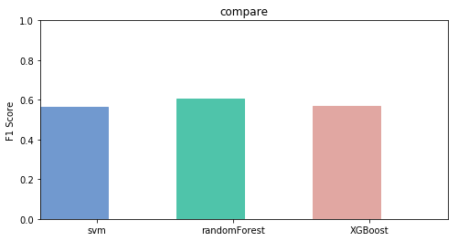

# 用 SVM,RandomForest,XGBoost 多分类


这我解决的问题是用SVM，XGBoost，RandomForest来对用户评论进行情感分析，训练集是2万，验证集2千，测试集2千，标注的类型总4个类，正面情感，
负面情感，中立情感，没提到 分别是 1，-1，0，-2 来标注，接下来我分别创建3个分类模型，对此问题进行分析。


# 1.sklearn SVM.SVC

SVM 主要思想是在样本空间中建立一个最优超平面，将两类样本的隔离边缘最大化，是结构风险最小化（ SRM ）的近似实现
单一的svm是只能二分类，但我们要分类的是多分类，所以用svm.svc multiclass 多分类

1.惩罚系数C
即为我们第二节中SVM分类模型原型形式和对偶形式中的惩罚系数C，默认为1，一般需要通过交叉验证来选择一个合适的C。
一般来说，如果噪音点较多时，C需要小一些。
C类似于正则化中1λ的作用。C越大，拟合非线性的能力越强
2.核函数 kernel
核函数能提高模型的Feature维度（低维到高维），从而使SVM具有较好的非线性拟合能力。
3.核函数参数degree
核函数的系数(‘Poly’, ‘RBF’ and ‘Sigmoid’), 默认是gamma = 1 / n_features; 

使用SVM时，有两个点要注意：
若使用核函数，一定要对Feature做Feature Scaling(Normalization)
若训练集m太小，但Feature数量n很大，则训练数据不足以拟合复杂的非线性模型，这种情况下只能用linear-kernel（就是fi=xi
）不能用高斯核


```python
import pandas as pd
import numpy as np
from sklearn.feature_extraction.text import TfidfVectorizer
from sklearn.linear_model import LogisticRegression
from sklearn.naive_bayes import MultinomialNB
from sklearn.svm import SVC
from sklearn.metrics import accuracy_score , roc_auc_score , roc_curve
from sklearn.model_selection import train_test_split
from sklearn.multiclass import OneVsRestClassifier
from sklearn.utils import shuffle
import sys
from sklearn.metrics import f1_score

```

导入必要的库


```python
import matplotlib.pyplot as plt
import numpy as np
def DrawGraph(scores): 
    plt.rcParams['figure.figsize'] = (8.0, 4)
    d_map = {
    'svm': (scores[0], '#7199cf'),
    'randomForest': (scores[1], '#4fc4aa'),
    'XGBoost': (scores[2], '#e1a7a2')
    }
    # 整体图的标题
    fig = plt.figure('Bar chart & Pie chart')
    # 在整张图上加入一个子图，121的意思是在一个1行2列的子图中的第一张
    ax = fig.add_subplot(111)
    ax.set_title('compare')
     # 生成x轴每个元素的位置
    xticks = np.arange(3)
     # 定义柱状图每个柱的宽度
    bar_width = 0.5
    animals = d_map.keys()
    values = [x[0] for x in d_map.values()] 
    # 对应颜色
    colors = [x[1] for x in d_map.values()]
    # 画柱状图，横轴是动物标签的位置，纵轴是速度，定义柱的宽度，同时设置柱的边缘为透明
    bars = ax.bar(xticks, values, width=bar_width, edgecolor='none') 
    # 设置y轴的标题
    ax.set_ylabel('F1 Score')
    # x轴每个标签的具体位置，设置为每个柱的中央
    ax.set_xticks(xticks+bar_width/3) 
    # 设置每个标签的名字
    ax.set_xticklabels(animals)
    # 设置x轴的范围
    ax.set_xlim([bar_width/2-0.5, 3-bar_width/2]) 
    # 设置y轴的范围
    ax.set_ylim(0, +1.00) 
    # 给每个bar分配指定的颜色
    for bar, color in zip(bars, colors):
        bar.set_color(color)
    plt.show()
```


```python
def segmentWord(cont): 
    c = [] 
    for i in cont:
       a = list(jieba.cut(i))
       b = " ".join(a)
       c.append(b) 
    return c
```

通过以上函数对中文文本分词，用jieba来分。


```python
def readData(d_train ,d_valid, d_test):
    print("训练样本 = %d" % len(d_train))
    print("验证样本 = %d" % len(d_valid))
    print("测试样本 = %d" %len(d_test))
    content_train=segmentWord(d_train['content'])
    content_valid=segmentWord(d_valid['content'])
    content_test=segmentWord(d_test['content'])
    
    lb_train=d_train['label']
    lb_valid=d_valid['label']
    #vectorizer = TfidfVectorizer(ngram_range=(1,2),min_df=2 ) #tf-idf特征抽取ngram_range=(1,2)
    vectorizer = TfidfVectorizer(analyzer='word',min_df=3,token_pattern=r"(?u)\b\w\w+\b")
    features = vectorizer.fit_transform(content_train)
    weight=features.toarray()
    print("训练样本特征表长度为 " + str(features.shape))
    # print(vectorizer.get_feature_names()) #特征名展示
    valid_features = vectorizer.transform(content_valid)
    valid_weight=valid_features.toarray()
    print("验证样本特征表长度为 "+ str(valid_features.shape))
    test_features = vectorizer.transform(content_test)
    test_weight=test_features.toarray()
    print("测试样本特征表长度为 "+ str(test_features.shape))
    data=[content_train,content_valid,content_test,lb_train,lb_valid,features,valid_features,test_features,weight,valid_weight,test_weight]
    return data
```

以上函数是用来准备数据并向量化，提取特征


```python
def svm_model(data):
    print("--------------------------------------")
    print("SVM 开始训练了")
    content_train,content_valid,content_test,lb_train,lb_valid,features,valid_features,test_features,weight,valid_weight,test_weight=data
    #支持向量机
    #C: 目标函数的惩罚系数C，用来平衡分类间隔margin和错分样本的，default C = 1.0
    svmmodel =OneVsRestClassifier(SVC(C=1,kernel= "linear",degree=3))#kernel：参数选择有rbf, linear, poly, Sigmoid, 默认的是"RBF";ß
#     parameters = {
#     "estimator__C": [1,2,4,8],
#     "estimator__kernel": ["poly","rbf"],
#     "estimator__degree":[1, 2, 3, 4],
#     }
#     model_tunning = GridSearchCV(svmmodel, param_grid=parameters)

    svmmodel.fit(features , lb_train)
#     print( model_tunning.best_score_)
#     print (model_tunning.best_params_)
    preds=svmmodel.predict(valid_features)
    f1=f1_score(lb_valid, preds, average='macro')
    scores.append(f1)
    print(f1)
```

以上SVM模型中，我试调C，kernel，degree 等参数，通过发现数据集比较少的时候linear的效果好点，数据集离散的用poly，还用GridSearchCV来参数优化了，进过实验发现，在数据少的情况下自动调优效果不明显。

## 2.RandomForest

随机森林是一个集成工具，它使用观测数据的子集和变量的子集来建立一个决策树。
它建立多个这样的决策树，然后将他们合并在一起以获得更准确和稳定的预测。 
这样做最直接的事实是，在这一组独立的预测结果中，用投票方式得到一个最高投票结果，这个比单独使用最好模型预测的结果要好。


```python
from sklearn.tree import DecisionTreeRegressor  
from sklearn.ensemble import RandomForestRegressor  
import numpy as np  
```


```python
def RF_model(data):
    print("--------------------------------------")
    print("RandomForest 开始训练了")
    content_train,content_valid,content_test,lb_train,lb_valid,features,valid_features,test_features,weight,valid_weight,test_weight=data
    rf=RandomForestRegressor()#这里使用了默认的参数设置 
    print(rf)
    rf.fit(features,lb_train)#进行模型的训练
    preds=rf.predict(valid_features)
    npre=[]
    for lb in preds:
        npre.append(np.round(lb))
    f1=f1_score(lb_valid, npre, average='macro')
    scores.append(f1)
    print(f1)
```

以下分析一下一些参数：
1.max_features：
随机森林允许单个决策树使用特征的最大数量。
    增加max_features一般能提高模型的性能，因为在每个节点上，我们有更多的选择可以考虑。
然而，这未必完全是对的，因为它降低了单个树的多样性，而这正是随机森林独特的优点。 
但是，可以肯定，你通过增加max_features会降低算法的速度。 因此，你需要适当的平衡和选择最佳max_features。
2.n_estimators 投票数：
在利用最大投票数或平均值来预测之前，你想要建立子树的数量。 
较多的子树可以让模型有更好的性能，但同时让你的代码变慢。 你应该选择尽可能高的值，只要你的处理器能够承受的住，因为这使你的预测更好更稳定。
3.min_sample_leaf：
 叶是决策树的末端节点。 较小的叶子使模型更容易捕捉训练数据中的噪声。
一般来说，偏向于将最小叶子节点数目设置为大于50。在自己的情况中，应该尽量尝试多种叶子大小种类，以找到最优的那个。

## 3.XGBoost

XGboost是以决策树（CART）为基学习器的GB算法
Gradient boosting(GB)
机器学习中的学习算法的目标是为了优化或者说最小化loss Function， Gradient boosting的思想是迭代生多个（M个）弱的模型，
然后将每个弱模型的预测结果相加，后面的模型Fm+1(x)基于前面学习模型的Fm(x)的效果生成的，关系如下：
                                                
                                                                Fm+1(x)=Fm(x)+h(x)


```python
import xgboost as xgb
import csv
import jieba
# jieba.load_userdict('wordDict.txt') 
import numpy as np
from sklearn.feature_extraction.text import CountVectorizer
from sklearn.feature_extraction.text import TfidfTransformer # 读取训练集 
import pandas as pd

from sklearn.grid_search import GridSearchCV
from xgboost import XGBClassifier
```


```python
def xgboost_model(data):
    print("--------------------------------------")
    print("XGBoost 开始训练了")
    content_train,content_valid,content_test,lb_train,lb_valid,features,valid_features,test_features,weight,valid_weight,test_weight=data

    lb_train=lb_train.replace(-1,2) #替换标签
    lb_train=lb_train.replace(-2,3)

    lb_valid=lb_valid.replace(-1,2) #替换标签
    lb_valid=lb_valid.replace(-2,3)
    
    dtrain = xgb.DMatrix(weight, label=lb_train) 
    dvalid = xgb.DMatrix(valid_weight, label=lb_valid) 
    dtest = xgb.DMatrix(test_weight) # label可以不要，此处需要是为了测试效果
    
#     param_test7 = { 'reg_alpha':[0, 0.001, 0.005, 0.01, 0.05]}
#     gsearch7 = GridSearchCV(estimator = XGBClassifier( learning_rate =0.1, n_estimators=177, max_depth=4, min_child_weight=6, 
#     gamma=0.1, subsample=0.8, colsample_bytree=0.8, objective= 'multi:softmax'),param_grid = param_test7, cv=5)
#     gsearch7.fit(weight,lb_train)
#     print(gsearch7.grid_scores_)
#     print(gsearch7.best_params_, )
#     print(gsearch7.best_score_)
    param = {'max_depth':8, 'eta':0.1, 'eval_metric':'merror', 'silent':1, 'objective':'multi:softmax', 'num_class':4} # 参数 
    evallist = [(dtrain,'train'), (dvalid,'test')] # 这步可以不要，用于测试效果 
    num_round = 10 # 循环次数
    bst = xgb.train(param, dtrain, num_round, evallist) 
    preds = bst.predict(dvalid)
    f1=f1_score(lb_valid, preds, average='macro')
    scores.append(f1)
    print(f1)
```

XGBoost 参数
在运行XGBoost程序之前，必须设置三种类型的参数：通用类型参数（general parameters）、booster参数和学习任务参数（task parameters）。
一般类型参数general parameters –参数决定在提升的过程中用哪种booster，常见的booster有树模型和线性模型。
Booster参数-该参数的设置依赖于我们选择哪一种booster模型。
学习任务参数task parameters-参数的设置决定着哪一种学习场景，例如，回归任务会使用不同的参数来控制着排序任务。
命令行参数-一般和xgboost的CL版本相关。
Booster参数：
1. eta[默认是0.3] 和GBM中的learning rate参数类似。通过减少每一步的权重，可以提高模型的鲁棒性。典型值0.01-0.2
2. min_child_weight[默认是1] 决定最小叶子节点样本权重和。当它的值较大时，可以避免模型学习到局部的特殊样本。但如果这个值过高，会导致欠拟合。这个参数需要用cv来调整
3. max_depth [默认是6] 树的最大深度，这个值也是用来避免过拟合的3-10
4. max_leaf_nodes 树上最大的节点或叶子的数量，可以代替max_depth的作用，应为如果生成的是二叉树，一个深度为n的树最多生成2n个叶子,如果定义了这个参数max_depth会被忽略
5. gamma[默认是0] 在节点分裂时，只有在分裂后损失函数的值下降了，才会分裂这个节点。Gamma指定了节点分裂所需的最小损失函数下降值。这个参数值越大，算法越保守。
6. max_delta_step[默认是0] 这参数限制每颗树权重改变的最大步长。如果是0意味着没有约束。如果是正值那么这个算法会更保守，通常不需要设置。
7. subsample[默认是1] 这个参数控制对于每棵树，随机采样的比例。减小这个参数的值算法会更加保守，避免过拟合。但是这个值设置的过小，它可能会导致欠拟合。典型值：0.5-1
8. colsample_bytree[默认是1] 用来控制每颗树随机采样的列数的占比每一列是一个特征0.5-1
9. colsample_bylevel[默认是1] 用来控制的每一级的每一次分裂，对列数的采样的占比。
10. lambda[默认是1] 权重的L2正则化项
11. alpha[默认是1] 权重的L1正则化项
12. scale_pos_weight[默认是1] 各类样本十分不平衡时，把这个参数设置为一个正数，可以使算法更快收敛。
通用参数：
1． booster[默认是gbtree]
选择每次迭代的模型，有两种选择：gbtree基于树的模型、gbliner线性模型
2． silent[默认是0]
当这个参数值为1的时候，静默模式开启，不会输出任何信息。一般这个参数保持默认的0，这样可以帮我们更好的理解模型。
学习目标参数：
1． objective[默认是reg：linear]
这个参数定义需要被最小化的损失函数。最常用的值有：binary：logistic二分类的逻辑回归，返回预测的概率非类别。multi:softmax使用softmax的多分类器，返回预测的类别。在这种情况下，你还要多设置一个参数：num_class类别数目。
2． eval_metric[默认值取决于objective参数的取之]
对于有效数据的度量方法。对于回归问题，默认值是rmse，对于分类问题，默认是error。典型值有：rmse均方根误差；mae平均绝对误差；logloss负对数似然函数值；error二分类错误率；merror多分类错误率；mlogloss多分类损失函数；auc曲线下面积。
3． seed[默认是0]
随机数的种子，设置它可以复现随机数据的结果，也可以用于调整参数。


```python
scores=[]
data=pd.read_csv('data.csv',encoding="utf_8",nrows=1000)# 少量数据集
data=shuffle(data)
d_train=shuffle(data.sample(frac=0.9))
d_valid=shuffle(data.sample(frac=0.1))
d_test=shuffle(data.sample(frac=0.1))
data=readData(d_train ,d_valid, d_test)
svm_model(data)
RF_model(data)
xgboost_model(data)
scores1=scores
###########################
# scores=[]
# data=pd.read_csv('data.csv',encoding="utf_8")## 全数据
# data=shuffle(data)
# d_train=shuffle(data.sample(frac=0.9))
# d_valid=shuffle(data.sample(frac=0.1))
# d_test=shuffle(data.sample(frac=0.1))
# data=readData(d_train ,d_valid, d_test)
# svm_model(data)
# RF_model(data)
# xgboost_model(data)
DrawGraph(scores1)
# DrawGraph(scores)
# print('all finish')
```

    训练样本 = 900
    验证样本 = 100
    测试样本 = 100
    训练样本特征表长度为 (900, 4122)
    验证样本特征表长度为 (100, 4122)
    测试样本特征表长度为 (100, 4122)
    --------------------------------------
    SVM 开始训练了


    /home/kazgu/anaconda3/lib/python3.7/site-packages/sklearn/metrics/classification.py:1135: UndefinedMetricWarning: F-score is ill-defined and being set to 0.0 in labels with no predicted samples.
      'precision', 'predicted', average, warn_for)


    0.5670212765957447
    --------------------------------------
    RandomForest 开始训练了
    RandomForestRegressor(bootstrap=True, criterion='mse', max_depth=None,
               max_features='auto', max_leaf_nodes=None,
               min_impurity_decrease=0.0, min_impurity_split=None,
               min_samples_leaf=1, min_samples_split=2,
               min_weight_fraction_leaf=0.0, n_estimators=10, n_jobs=1,
               oob_score=False, random_state=None, verbose=0, warm_start=False)
    0.6055555555555555
    --------------------------------------
    XGBoost 开始训练了
    [0]	train-merror:0.043333	test-merror:0.05
    [1]	train-merror:0.048889	test-merror:0.05
    [2]	train-merror:0.046667	test-merror:0.05
    [3]	train-merror:0.043333	test-merror:0.05
    [4]	train-merror:0.042222	test-merror:0.06
    [5]	train-merror:0.038889	test-merror:0.06
    [6]	train-merror:0.037778	test-merror:0.06
    [7]	train-merror:0.035556	test-merror:0.06
    [8]	train-merror:0.036667	test-merror:0.06
    [9]	train-merror:0.035556	test-merror:0.06
    0.5683155080213904





通过两次选择不同的大小的训练集，结果不太一致，数据集较大的时候SVM onevsrestclassifier 表现跟好的效果，randomForest几乎保持自己的状态
，XGBoost稍微下降。


```python

```
